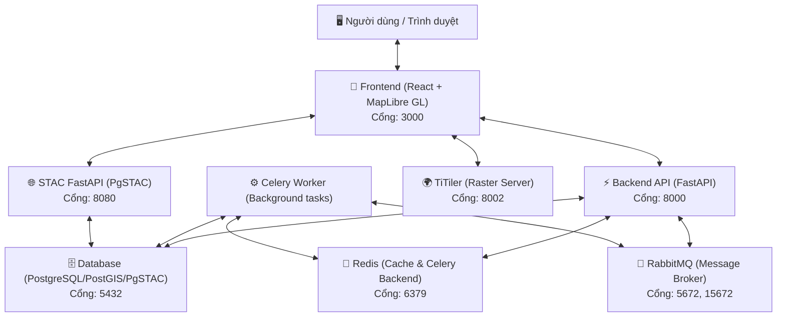

# STAC-Based Satellite Visualization Platform

Nền tảng xử lý và trực quan hóa ảnh vệ tinh hiệu năng cao dựa trên chuẩn STAC (SpatioTemporal Asset Catalog). Dự án này được thiết kế để quản lý, tìm kiếm và trực quan hóa dữ liệu không gian thời gian lớn phục vụ cho các ứng dụng GIS hiện đại.

---

## 🗺️ Kiến trúc hệ thống (Architecture Diagram)

Sơ đồ liên thông giữa các dịch vụ trong mạng lưới `satellite-network` thuộc hệ thống Docker Compose:



---

## 🛠️ Danh sách Công nghệ & Dịch vụ (Tech Stack)

Dự án được xây dựng dưới dạng **Monolith** dùng chung codebase ở backend cho cả API và Worker, giúp đồng bộ hóa các định nghĩa model và logic nghiệp vụ.

| Thành phần | Công nghệ / Container Image | Cổng ngoài (Host Port) | Vai trò |
| :--- | :--- | :--- | :--- |
| **Frontend** | React 19 + TypeScript + Vite + MapLibre GL | `3000` | Trực quan hóa bản đồ, tương tác công cụ đo đạc và lọc tìm kiếm dữ liệu. |
| **Backend** | FastAPI (Python 3.11) | `8000` | API chính của hệ thống, quản lý người dùng, AOI, Jobs và tích hợp WebSocket. |
| **Celery Worker** | Python 3.11 (Celery process) | *Nội bộ network* | Xử lý các tác vụ không đồng bộ tải nặng (download ảnh vệ tinh, phân tích AI). |
| **Database** | `ghcr.io/stac-utils/pgstac:latest` | `5432` | Cơ sở dữ liệu Postgres + PostGIS tích hợp sẵn schema pgSTAC để lưu metadata STAC. |
| **STAC API** | `ghcr.io/stac-utils/stac-fastapi-pgstac` | `8080` | STAC Compliant API phục vụ truy vấn Catalog/Collection/Item. |
| **TiTiler** | `developmentseed/titiler:latest` | `8002` | Server render ảnh vệ tinh COG (Cloud Optimized GeoTIFF) sang dạng bản đồ Tiles (XYZ). |
| **Redis** | `redis:7-alpine` | `6379` | Làm bộ nhớ đệm (Cache) và kết quả tác vụ (Celery Backend). |
| **RabbitMQ** | `rabbitmq:3-management-alpine` | `5672`, `15672` | Bộ chuyển tải thông điệp (Message Broker) điều phối tác vụ cho Celery Worker. |

---

## 🚀 Hướng dẫn Cài đặt & Setup (Setup Guide)

### Yêu cầu hệ thống
- Máy tính đã cài đặt **Docker** và **Docker Compose**.
- Đã cài đặt **Git** để clone mã nguồn.

### Các bước chuẩn bị

1. **Clone repository về máy local:**
   ```bash
   git clone https://github.com/trandinhhao/stac-based-satellite-visualization-platform.git
   cd stac-based-satellite-visualization-platform
   ```

2. **Cấu hình môi trường (Environment Variables):**
   Dự án quản lý tập trung toàn bộ cấu hình trong các file môi trường. Bạn chỉ cần sao chép file `.env.example` thành `.env` (chúng chứa các cấu hình mặc định sẵn sàng chạy ngay cho local development):
   ```bash
   cp .env.example .env
   ```

   > [!NOTE]
   > Tất cả giá trị cấu hình kết nối CSDL, Redis, RabbitMQ, và các cổng ánh xạ ra ngoài máy host đều được khai báo trong `.env`. Cả hai file `.env` và `.env.example` được giữ đồng nhất giống hệt nhau về các tham số mặc định.

---

## 🏃 Vận hành hệ thống (Run Guide)

### 1. Khởi động toàn bộ hệ thống
Để khởi tạo và chạy toàn bộ 8 services đồng thời trong mạng lưới docker, bạn chỉ cần chạy một lệnh duy nhất ở thư mục gốc chứa `docker-compose.yml`:

```bash
docker compose up -d --build
```

Lệnh này sẽ build Dockerfile cho `frontend`, `backend`, và `worker` đồng thời tải về các container images cần thiết khác từ Github Container Registry (pgstac) và DockerHub.

### 2. Kiểm tra trạng thái các Service
Kiểm tra xem các container đã khởi chạy thành công hay chưa bằng lệnh:
```bash
docker compose ps
```

Các dịch vụ sẽ sẵn sàng phục vụ tại các địa chỉ sau trên máy host của bạn:
- **Frontend App**: [http://localhost:3000](http://localhost:3000)
- **Backend Swagger API Docs**: [http://localhost:8000/docs](http://localhost:8000/docs)
- **STAC FastAPI Swagger**: [http://localhost:8080/docs](http://localhost:8080/docs)
- **RabbitMQ Management Portal**: [http://localhost:15672](http://localhost:15672) (Tài khoản mặc định: `guest` / `guest`)
- **TiTiler Server Info**: [http://localhost:8002/healthz](http://localhost:8002/healthz)

### 3. Kiểm tra sức khỏe hệ thống (Health Check APIs)
Để verify sự liên kết thông suốt giữa Backend FastAPI với các thành phần hạ tầng khác (Database, Redis, RabbitMQ), bạn có thể truy cập các endpoint sau:

- **Tổng thể API**: [http://localhost:8000/health](http://localhost:8000/health)
- **Database (PostgreSQL + PostGIS)**: [http://localhost:8000/health/db](http://localhost:8000/health/db)
- **Redis Connection**: [http://localhost:8000/health/redis](http://localhost:8000/health/redis)
- **RabbitMQ Connection**: [http://localhost:8000/health/rabbitmq](http://localhost:8000/health/rabbitmq)

### 4. Tắt hệ thống
Khi muốn giải phóng tài nguyên và dừng các container, sử dụng lệnh:
```bash
docker compose down
```
Nếu muốn xóa sạch dữ liệu lưu trữ tạm thời trong database và cache:
```bash
docker compose down -v
```
