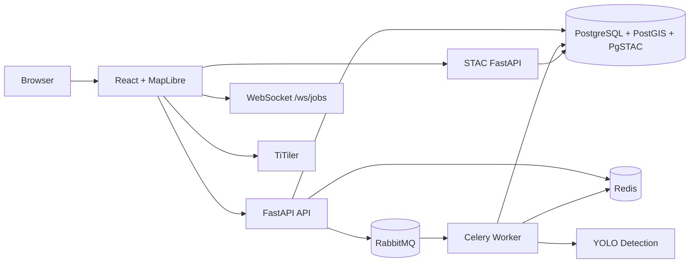

# STAC-Based Satellite Visualization Platform

Nền tảng trực quan hóa, tìm kiếm và xử lý ảnh vệ tinh dựa trên chuẩn STAC
(SpatioTemporal Asset Catalog). Dự án cung cấp một ứng dụng GIS chạy trên web
cho phép người dùng xem bản đồ, tìm kiếm dữ liệu vệ tinh, vẽ vùng quan tâm
(AOI), đo đạc không gian, quản lý tác vụ nền và chạy nhận diện đối tượng bằng
AI trên ảnh vệ tinh.

Tài liệu này phản ánh trạng thái mã nguồn hiện tại của dự án sau giai đoạn
triển khai chính. Một số phần trong thư mục `docs/` có nêu định hướng mở rộng,
nhưng những tính năng đã chạy trong code hiện tại tập trung vào: bản đồ tương
tác, AOI, đo đạc, STAC search, proxy Planet imagery, job processing, WebSocket
realtime và AI detection.

## 1. Mục tiêu dự án

Dự án được xây dựng để giải quyết một nhóm nhu cầu thường gặp trong các hệ
thống GIS và viễn thám:

- Hiển thị bản đồ nền và lớp ảnh vệ tinh trên trình duyệt.
- Tìm kiếm ảnh vệ tinh theo thời gian, không gian và collection.
- Lưu, chỉnh sửa, import/export các vùng AOI bằng GeoJSON.
- Đo khoảng cách, diện tích và chu vi trên bản đồ.
- Theo dõi các tác vụ xử lý nền theo thời gian thực.
- Chạy pipeline AI nhận diện máy bay, tàu và xe trong vùng AOI.
- Lưu kết quả nhận diện dưới dạng bounding box địa lý để overlay lên bản đồ.

Kiến trúc được thiết kế theo hướng thực dụng cho môi trường demo/local bằng
Docker Compose, đồng thời vẫn đủ modular để mở rộng thành hệ thống production
trong tương lai.

## 2. Tính năng đã triển khai

### 2.1 Bản đồ tương tác

Frontend sử dụng React, TypeScript và MapLibre GL để hiển thị bản đồ toàn màn
hình. Người dùng có thể:

- Pan, zoom và reset về vị trí mặc định.
- Chuyển đổi lớp bản đồ nền.
- Xem tọa độ tâm bản đồ và mức zoom hiện tại.
- Hiển thị AOI đã lưu.
- Hiển thị kết quả STAC được chọn.
- Hiển thị kết quả AI detection bằng bounding box.

Component bản đồ chính nằm tại `frontend/src/components/MapViewer.tsx`.

### 2.2 Quản lý AOI

AOI là vùng quan tâm do người dùng vẽ trên bản đồ. Hệ thống hỗ trợ:

- Vẽ polygon, rectangle và circle.
- Lưu AOI vào PostgreSQL/PostGIS.
- Tự động tính diện tích và chu vi bằng PostGIS geography.
- Cập nhật tên, mô tả và hình học.
- Xóa AOI cùng các job và detection liên quan.
- Import GeoJSON từ file.
- Export AOI ra GeoJSON Feature.
- Chọn một hoặc nhiều AOI để xem trên bản đồ.

Các API tương ứng nằm trong `backend/api/aois.py`.

### 2.3 Đo đạc không gian

Người dùng có thể đo:

- Khoảng cách theo LineString.
- Diện tích và chu vi theo Polygon.

Frontend có tính toán tức thời để hiển thị trải nghiệm mượt hơn, còn backend
có endpoint `/api/v1/measure` dùng PostGIS để tính giá trị địa lý chính xác
hơn trên hệ tọa độ WGS84.

### 2.4 STAC search và Planet imagery

Backend cung cấp nhóm API `/api/v1/stac` để:

- Lấy danh sách collection.
- Tìm kiếm item theo bbox, geometry, thời gian và collection.
- Cache kết quả search bằng Redis.
- Proxy tile và thumbnail từ Planet API để không lộ API key ra frontend.

Phần tìm kiếm STAC nằm trong `backend/services/stac/`. Frontend gọi backend
qua Axios instance trong `frontend/src/services/api.ts`.

### 2.5 Job processing và realtime progress

Các tác vụ nặng, đặc biệt AI detection, được chạy bằng Celery worker. Luồng
chính:

1. Frontend tạo job qua `/api/v1/jobs` hoặc `/api/v1/detections`.
2. Backend ghi bản ghi job vào PostgreSQL.
3. Backend đẩy task vào RabbitMQ.
4. Celery worker nhận task, xử lý và cập nhật tiến trình.
5. Worker publish trạng thái lên Redis Pub/Sub channel `job_updates`.
6. FastAPI listener nhận event và broadcast tới frontend qua WebSocket.
7. Frontend cập nhật job widget và notification realtime.

WebSocket endpoint hiện tại là:

```text
ws://localhost:8000/ws/jobs
```

Trong môi trường Docker/Vite, frontend dùng proxy `/ws` tới backend.

### 2.6 AI object detection

Pipeline AI hiện tại được triển khai ở `backend/services/ai/detector.py` và
được gọi từ Celery task trong `backend/workers/tasks.py`.

Các lớp đối tượng mục tiêu:

- `aircraft`
- `ship`
- `vehicle`

Pipeline hỗ trợ:

- Tải và ghép tile ảnh vệ tinh theo vùng AOI.
- Chạy nhiều model YOLO chuyên biệt nếu có file trọng số trong thư mục
  `backend/services/ai/training/`.
- Chạy fallback/mock detection nếu thiếu model hoặc thư viện ML.
- Non-Maximum Suppression theo từng lớp.
- Lọc chồng chéo giữa các lớp đối tượng.
- Lọc một số trường hợp nhận diện nhầm theo ngữ cảnh.
- Lọc kết quả theo ranh giới polygon AOI.
- Lưu bounding box địa lý vào bảng `detections`.

## 3. Kiến trúc tổng quan

Hệ thống chạy bằng Docker Compose với các service chính:

| Service | Công nghệ | Vai trò |
| --- | --- | --- |
| `frontend` | React, TypeScript, Vite, MapLibre GL | Giao diện bản đồ và công cụ GIS |
| `backend` | FastAPI, SQLAlchemy, Pydantic | REST API, WebSocket, điều phối nghiệp vụ |
| `worker` | Celery | Xử lý tác vụ nền và AI detection |
| `postgis` | PgSTAC/PostgreSQL/PostGIS | Lưu dữ liệu nghiệp vụ và metadata STAC |
| `stac-fastapi` | stac-fastapi-pgstac | STAC API service |
| `titiler` | TiTiler | Tile/raster service cho COG |
| `redis` | Redis | Cache, Celery result backend, Pub/Sub realtime |
| `rabbitmq` | RabbitMQ | Message broker cho Celery |

Sơ đồ rút gọn:



## 4. Cấu trúc thư mục

```text
.
├── backend/
│   ├── api/                 # FastAPI routers: AOI, STAC, measure, jobs, detections, websocket
│   ├── db/                  # SQLAlchemy engine/session
│   ├── models/              # ORM models: AOI, Job, Detection
│   ├── schemas/             # Pydantic schemas
│   ├── services/            # STAC, Redis cache, AI detector
│   ├── workers/             # Celery app và tasks
│   ├── alembic/             # Database migrations
│   ├── main.py              # FastAPI entrypoint
│   ├── Dockerfile
│   └── requirements.txt
├── frontend/
│   ├── src/
│   │   ├── components/      # Map, panels, widgets, toasts
│   │   ├── layouts/         # MainLayout
│   │   ├── services/        # Axios clients
│   │   └── store/           # Zustand stores
│   ├── Dockerfile
│   ├── package.json
│   └── vite.config.ts
├── docs/                    # Tài liệu kiến trúc, API, dữ liệu, triển khai, hướng dẫn
├── docker-compose.yml
├── .env.example
└── README.md
```

## 5. Yêu cầu hệ thống

Cho môi trường local/demo:

- Docker Desktop hoặc Docker Engine + Docker Compose.
- Git.
- Tối thiểu 8 GB RAM, khuyến nghị 16 GB nếu chạy AI model.
- CPU hiện đại; GPU là tùy chọn nhưng hữu ích cho YOLO.
- Kết nối internet nếu dùng Planet API, basemap online hoặc tải model mặc định.

Nếu chạy frontend/backend thủ công ngoài Docker:

- Node.js 20+.
- Python 3.10+.
- PostgreSQL/PostGIS hoặc container `postgis` từ compose.
- Redis và RabbitMQ.

## 6. Cấu hình môi trường

Sao chép file cấu hình mẫu:

```bash
cp .env.example .env
```

Các biến quan trọng:

| Biến | Ý nghĩa |
| --- | --- |
| `POSTGRES_DB` | Tên database chính |
| `POSTGRES_USER` | User PostgreSQL |
| `POSTGRES_PASSWORD` | Password PostgreSQL |
| `PGHOST`, `PGPORT`, `PGUSER`, `PGPASSWORD`, `PGDATABASE` | Kết nối cho STAC FastAPI |
| `DATABASE_URL` | Kết nối backend/worker tới PostgreSQL |
| `REDIS_URL` | Kết nối Redis |
| `RABBITMQ_URL` | Kết nối RabbitMQ |
| `PLANET_API_KEY` | API key Planet Labs, dùng cho Planet search/tile/thumbnail |
| `VITE_MAPBOX_ACCESS_TOKEN` | Token Mapbox nếu dùng geocoding hoặc layer yêu cầu token |

Lưu ý: `.env.example` chứa giá trị placeholder. Với tính năng Planet thật, cần
thay `PLANET_API_KEY=your_planet_api_key_here` bằng key hợp lệ.

## 7. Chạy toàn bộ hệ thống bằng Docker Compose

Từ thư mục gốc:

```bash
docker compose up -d --build
```

Kiểm tra container:

```bash
docker compose ps
```

Các địa chỉ thường dùng:

| Thành phần | URL |
| --- | --- |
| Frontend | http://localhost:3000 |
| Backend Swagger | http://localhost:8000/docs |
| Backend health | http://localhost:8000/health |
| STAC FastAPI Swagger | http://localhost:8080/docs |
| TiTiler health | http://localhost:8002/healthz |
| RabbitMQ Management | http://localhost:15672 |

Tài khoản RabbitMQ mặc định theo `.env.example`:

```text
guest / guest
```

## 8. Database migration

Dự án có Alembic migrations cho các bảng nghiệp vụ `aois`, `jobs` và
`detections`. Sau khi database sẵn sàng, chạy migration trong container backend:

```bash
docker compose exec backend alembic upgrade head
```

Nếu chạy backend trực tiếp trên máy:

```bash
cd backend
alembic upgrade head
```

Khuyến nghị chạy migration ngay sau lần đầu khởi động PostGIS để tránh lỗi API
do thiếu bảng.

## 9. Dừng hệ thống

Dừng container nhưng giữ volume dữ liệu:

```bash
docker compose down
```

Dừng và xóa volume dữ liệu:

```bash
docker compose down -v
```

Lệnh `down -v` sẽ xóa dữ liệu PostgreSQL và Redis trong Docker volume, chỉ dùng
khi muốn reset môi trường local.

## 10. API chính

Backend version hiện tại dùng prefix `/api/v1` cho REST API.

| Nhóm | Endpoint |
| --- | --- |
| Health | `GET /health`, `GET /api/v1/health`, `GET /health/db`, `GET /health/redis`, `GET /health/rabbitmq` |
| AOI | `GET/POST /api/v1/aois`, `GET/PUT/DELETE /api/v1/aois/{id}` |
| AOI import/export | `POST /api/v1/aois/import`, `GET /api/v1/aois/{id}/export` |
| Measurement | `POST /api/v1/measure` |
| STAC | `GET /api/v1/stac/collections`, `POST /api/v1/stac/search` |
| Planet proxy | `GET /api/v1/stac/planet/tiles/...`, `GET /api/v1/stac/planet/thumbnail/{scene_id}` |
| Jobs | `GET/POST /api/v1/jobs`, `GET/DELETE /api/v1/jobs/{job_id}` |
| Detections | `POST /api/v1/detections`, `GET /api/v1/detections/{job_id}` |
| WebSocket | `WS /ws/jobs` |

Chi tiết request/response xem `docs/api-design.md`.

## 11. Trạng thái production

Repo hiện tại phù hợp nhất cho:

- Demo kỹ thuật.
- Đồ án/khóa luận/prototype có chạy thật.
- Môi trường local hoặc server đơn bằng Docker Compose.
- Nghiên cứu pipeline GIS + AI detection.

Những việc nên làm trước khi dùng production:

- Tách Dockerfile production cho frontend static build và backend không dùng `--reload`.
- Tự động hóa migration trong deployment pipeline.
- Bổ sung authentication/authorization.
- Bổ sung rate limit và kiểm soát CORS/allowed hosts.
- Chuẩn hóa logging, tracing và error response.
- Viết test backend cho AOI, measurement, jobs và detections.
- Tách nhỏ `MapViewer.tsx` thành nhiều module dễ bảo trì hơn.
- Quản lý secrets bằng secret manager thay vì `.env` plain text.

## 12. Tài liệu liên quan

- `docs/project-overview.md`: Tổng quan dự án.
- `docs/architecture.md`: Kiến trúc hệ thống.
- `docs/tech-stack.md`: Công nghệ sử dụng.
- `docs/api-design.md`: Thiết kế API.
- `docs/database-design.md`: Thiết kế dữ liệu.
- `docs/deployment-guide.md`: Hướng dẫn triển khai.
- `docs/user-guide.md`: Hướng dẫn sử dụng giao diện.
- `docs/report.md`: Báo cáo tổng hợp.

