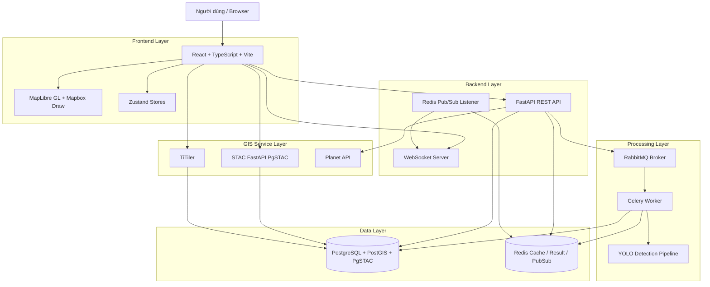
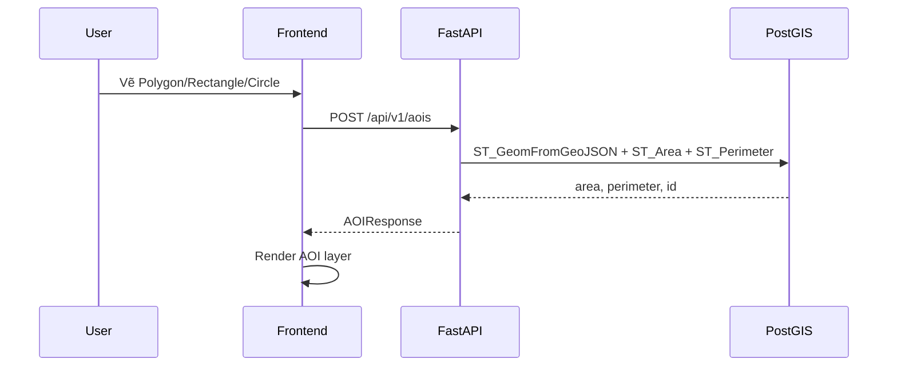
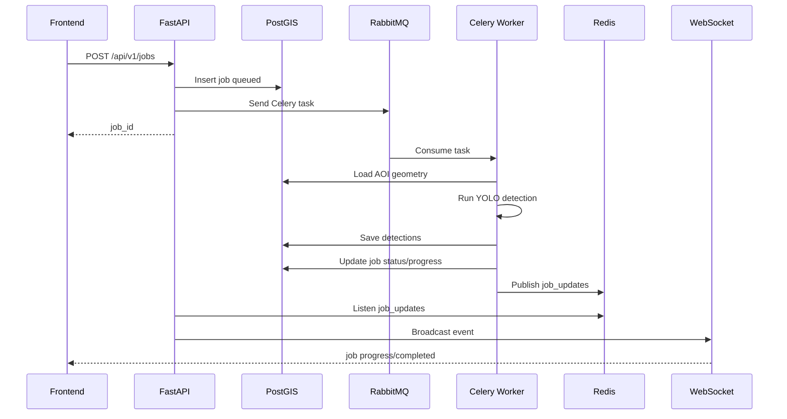

# Kiến trúc hệ thống

## 1. Tổng quan

Hệ thống được thiết kế theo kiến trúc nhiều lớp, kết hợp frontend GIS, backend
API, database không gian, dịch vụ STAC/raster và tầng xử lý bất đồng bộ. Mục
tiêu của kiến trúc là tách rõ trách nhiệm giữa phần hiển thị bản đồ, phần điều
phối nghiệp vụ, phần lưu trữ dữ liệu và phần xử lý tác vụ nặng.

Ở trạng thái hiện tại, toàn bộ hệ thống được triển khai bằng Docker Compose.
Đây là lựa chọn phù hợp cho local development, demo và môi trường thử nghiệm.

## 2. Sơ đồ tổng thể



## 3. Frontend Layer

Frontend là ứng dụng React chạy trên Vite. Lớp này chịu trách nhiệm toàn bộ trải
nghiệm bản đồ và các thao tác người dùng.

Các thành phần chính:

- `MainLayout`: bố cục ứng dụng, navigation rail, drawer, status bar.
- `MapViewer`: bản đồ MapLibre GL, draw modes, layer rendering.
- `AOIManagerPanel`: quản lý vùng AOI.
- `STACSearchPanel`: tìm kiếm ảnh vệ tinh.
- `MeasurementPanel`: đo đạc.
- `DetectionPanel`: tạo job AI detection.
- `FloatingJobsWidget`: theo dõi job.
- `NotificationToast`: hiển thị thông báo realtime.

State được chia thành nhiều Zustand store:

- Map state.
- AOI state.
- STAC state.
- Measurement state.
- Job state.
- Detection state.
- WebSocket state.
- Notification state.

## 4. Backend Layer

Backend là FastAPI app. Vai trò của backend không chỉ là CRUD API mà còn là bộ
điều phối giữa frontend, database, cache, message queue và worker.

Các router:

- `api/aois.py`
- `api/measure.py`
- `api/stac.py`
- `api/jobs.py`
- `api/detections.py`
- `api/websocket.py`

Backend dùng SQLAlchemy để kết nối PostgreSQL/PostGIS. Một số truy vấn không
gian dùng SQL thô vì cần gọi trực tiếp hàm PostGIS như `ST_Area`,
`ST_Perimeter`, `ST_GeomFromGeoJSON` và `ST_AsGeoJSON`.

## 5. Data Layer

Database chính là image `ghcr.io/stac-utils/pgstac:latest`, tức PostgreSQL đã
tích hợp PostGIS và PgSTAC. Database này có hai nhóm dữ liệu:

1. Dữ liệu nghiệp vụ của ứng dụng:
   - `aois`
   - `jobs`
   - `detections`

2. Dữ liệu STAC/PgSTAC:
   - catalog metadata
   - collections
   - items
   - assets

Redis được dùng cho:

- Cache collection/search result.
- Celery result backend.
- Pub/Sub channel `job_updates`.

## 6. Processing Layer

Các tác vụ nặng không chạy trực tiếp trong request HTTP. Backend tạo job và đẩy
task sang RabbitMQ. Celery worker nhận task và xử lý.

Task chính hiện tại:

```text
process_detection_task(job_id, aoi_id, collection)
```

Worker cập nhật trạng thái job theo các mốc:

- queued
- running
- completed
- failed
- cancelled

Mỗi lần cập nhật, worker publish event sang Redis để backend WebSocket listener
broadcast cho frontend.

## 7. GIS Service Layer

STAC FastAPI cung cấp API tương thích STAC để truy vấn metadata trong PgSTAC.

TiTiler phục vụ các nhu cầu raster/tile cho Cloud Optimized GeoTIFF hoặc các
nguồn raster tương thích. Trong code frontend, Vite proxy có path `/cog` trỏ
tới TiTiler.

Planet API được backend gọi qua proxy endpoint để:

- Lấy tile basemap.
- Lấy tile scene.
- Lấy thumbnail.
- Tìm metadata nâng cao trong service STAC search.

## 8. Luồng AOI



## 9. Luồng AI detection



## 10. Realtime architecture

Realtime được tách thành hai bước:

- Worker publish event vào Redis Pub/Sub.
- Backend đang chạy FastAPI listen Redis rồi broadcast qua WebSocket.

Cách này giúp worker không cần biết danh sách WebSocket connection. Nếu sau này
scale nhiều backend instance, cần bổ sung chiến lược quản lý connection hoặc
pub/sub fanout phù hợp hơn.

## 11. Các quyết định kiến trúc quan trọng

- Dùng Docker Compose để giảm chi phí setup.
- Dùng PostGIS cho tính toán hình học chính xác hơn frontend-only.
- Dùng Celery/RabbitMQ cho tác vụ AI nặng.
- Dùng Redis cho cache và realtime bridge.
- Dùng STAC/PgSTAC để bám chuẩn dữ liệu ảnh vệ tinh.
- Dùng MapLibre GL để tránh phụ thuộc Mapbox GL license.
- Dùng Zustand thay vì Redux để giảm boilerplate.

## 12. Điểm cần cải thiện

- Tách cấu hình development và production.
- Tự động chạy migration khi deploy.
- Bổ sung authentication.
- Chuẩn hóa error response.
- Refactor frontend map module.
- Thêm observability cho worker.
- Tách AI service riêng nếu tải inference tăng.

