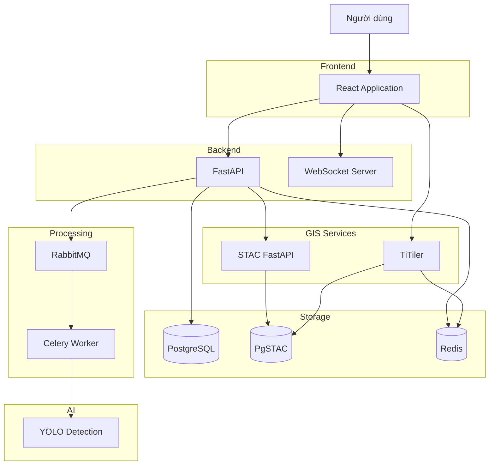
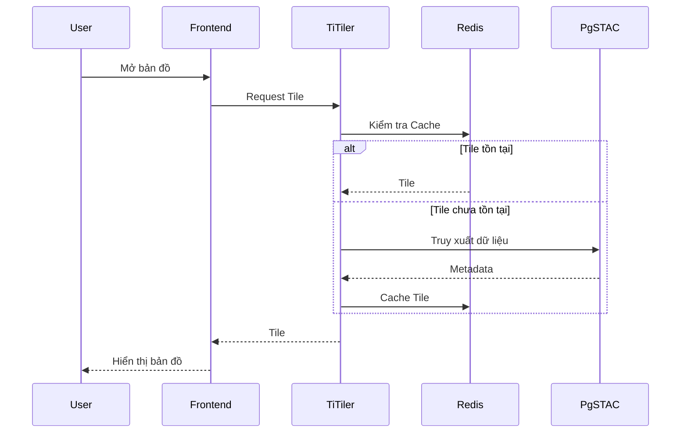
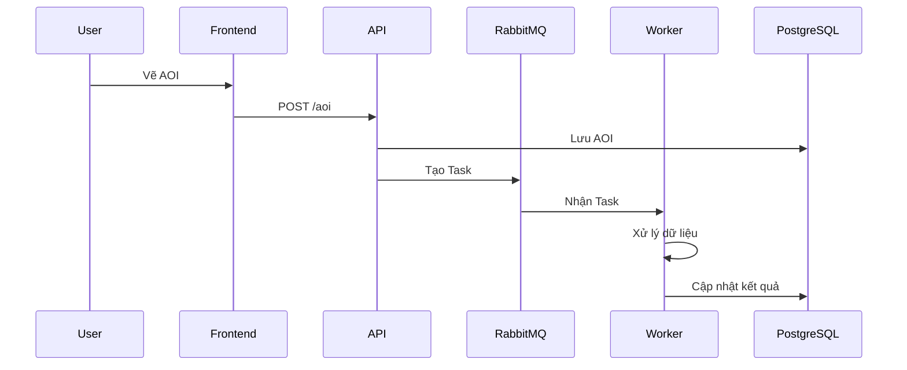
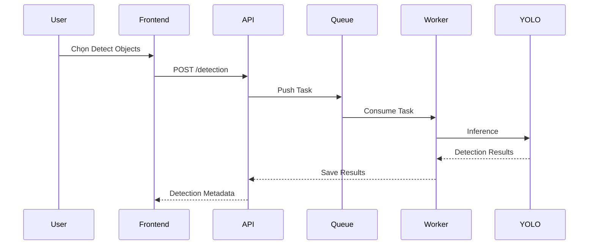
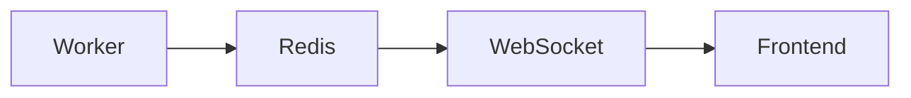

# architecture.md

# Kiến trúc hệ thống

## 1. Tổng quan kiến trúc

Hệ thống được xây dựng theo mô hình đa tầng (Multi-Tier Architecture) kết hợp với các thành phần chuyên biệt cho xử lý dữ liệu không gian và ảnh vệ tinh.

Mục tiêu của kiến trúc:

* Dễ mở rộng
* Dễ bảo trì
* Tách biệt trách nhiệm giữa các thành phần
* Hỗ trợ xử lý bất đồng bộ
* Tối ưu hiệu năng truy xuất dữ liệu ảnh vệ tinh

---

## 2. Kiến trúc tổng thể



---

## 3. Các thành phần chính

### 3.1 Frontend Layer

#### Vai trò

Cung cấp giao diện tương tác cho người dùng.

#### Chức năng

* Hiển thị bản đồ
* Hiển thị ảnh vệ tinh
* Quản lý layer
* Vẽ AOI
* Đo đạc
* So sánh ảnh
* Theo dõi tiến trình xử lý

#### Công nghệ

* React
* TypeScript
* MapLibre GL JS
* Turf.js
* Zustand

---

### 3.2 Backend Layer

#### Vai trò

Đóng vai trò API Gateway cho toàn bộ hệ thống.

#### Chức năng

* Xác thực người dùng
* Điều phối yêu cầu
* Quản lý AOI
* Quản lý tác vụ nền
* Kết nối STAC Services
* Kết nối Message Queue

#### Công nghệ

* FastAPI
* SQLAlchemy
* Pydantic

---

### 3.3 GIS Service Layer

#### STAC FastAPI

Chịu trách nhiệm:

* Truy vấn dữ liệu STAC
* Tìm kiếm theo không gian
* Tìm kiếm theo thời gian
* Truy vấn metadata

#### TiTiler

Chịu trách nhiệm:

* Render GeoTIFF
* Sinh map tile
* Cắt ảnh theo AOI
* Cung cấp tile cho frontend

---

### 3.4 Data Layer

#### PostgreSQL

Lưu dữ liệu nghiệp vụ:

* User
* AOI
* Jobs
* Detection Results

#### PgSTAC

Lưu metadata ảnh vệ tinh:

* Collections
* Items
* Assets

#### Redis

Cache:

* Tile Cache
* Metadata Cache
* Session Cache

---

### 3.5 Processing Layer

#### RabbitMQ

Chịu trách nhiệm:

* Hàng đợi tác vụ
* Điều phối worker

#### Celery Worker

Thực hiện:

* AOI Processing
* Image Extraction
* AI Detection
* Report Generation

---

### 3.6 AI Layer

#### YOLO Detection

Chịu trách nhiệm:

* Vehicle Detection
* Ship Detection
* Aircraft Detection

Kết quả trả về:

* Bounding Boxes
* Confidence Score
* Object Type

---

# 4. Kiến trúc dữ liệu STAC

## STAC Catalog Hierarchy

```text
Catalog
│
├── Collection
│   │
│   ├── Item
│   │   │
│   │   ├── Asset
│   │   ├── Asset
│   │   └── Asset
│   │
│   └── Item
│
└── Collection
```

---

## Ví dụ

```text
Sentinel-2 Collection
│
├── Image 2025-01-01
├── Image 2025-02-01
├── Image 2025-03-01
└── ...
```

Mỗi ảnh sẽ chứa:

* Tọa độ
* Thời gian chụp
* Độ phân giải
* Đường dẫn dữ liệu

---

# 5. Luồng hiển thị bản đồ



---

# 6. Luồng AOI Processing



---

# 7. Luồng AI Detection



---

# 8. Kiến trúc WebSocket

## Mục tiêu

Theo dõi tiến trình xử lý theo thời gian thực.

Ví dụ:

```text
Job Started
10%
20%
50%
75%
100%
```

---

## Luồng xử lý



---

# 9. Chiến lược Cache

## Redis Cache

### Tile Cache

```text
Tile Request
     ↓
Redis
     ↓
Hit -> Return
Miss -> Generate Tile
```

### Metadata Cache

Cache:

* Collection List
* Search Results
* STAC Metadata

---

# 10. Khả năng mở rộng

Kiến trúc hiện tại hỗ trợ:

### Horizontal Scaling

* Nhiều Backend Instance
* Nhiều Worker Instance
* Redis Cluster
* RabbitMQ Cluster

### Future Features

* Multi-Tenant
* AI Service riêng biệt
* Kubernetes Deployment
* Distributed Storage
* Multiple Satellite Sources

---

# 11. Định hướng triển khai

Giai đoạn Demo:

* Docker Compose
* Single PostgreSQL
* Single Redis
* Single RabbitMQ

Giai đoạn Production:

* Kubernetes
* Load Balancer
* Redis Cluster
* RabbitMQ Cluster
* Object Storage

---

# 12. Kết luận

Kiến trúc được thiết kế theo hướng:

* Modular
* Scalable
* Maintainable
* Cloud Native Ready

Đồng thời đáp ứng đầy đủ các yêu cầu:

* STAC Catalog
* Satellite Visualization
* AOI Processing
* Temporal Comparison
* Async Processing
* AI Integration
