# Data Flow Diagrams

## 1. Tổng quan

Tài liệu này mô tả các luồng dữ liệu chính trong hệ thống. Mục tiêu là giúp
người đọc hiểu dữ liệu đi qua frontend, backend, database, queue, worker và
WebSocket như thế nào.

## 2. Luồng mở ứng dụng

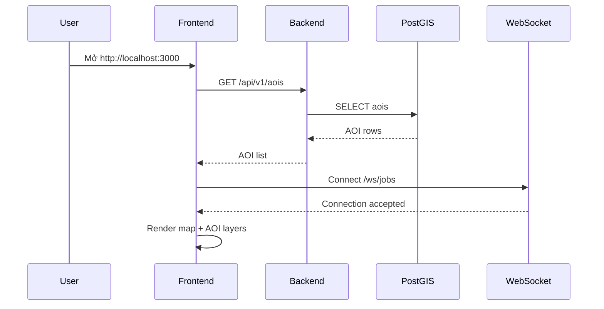

## 3. Luồng tạo AOI

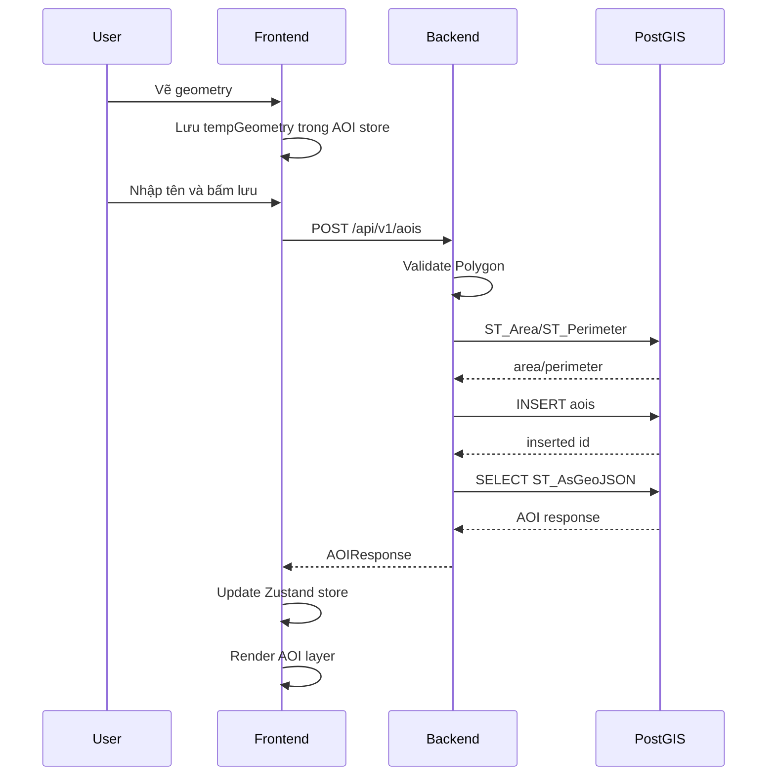

## 4. Luồng cập nhật AOI

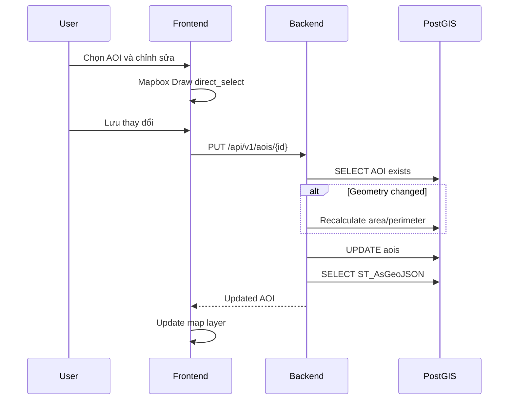

## 5. Luồng đo đạc

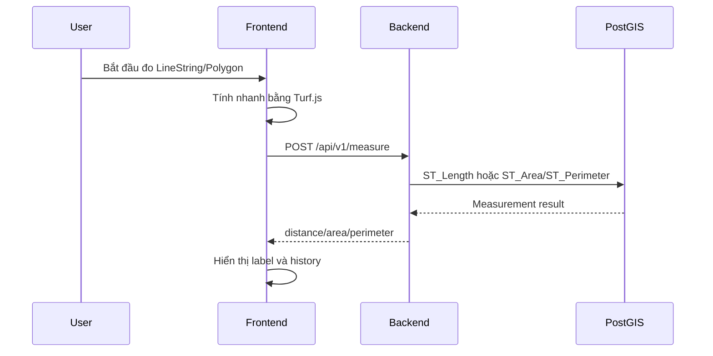

## 6. Luồng STAC search

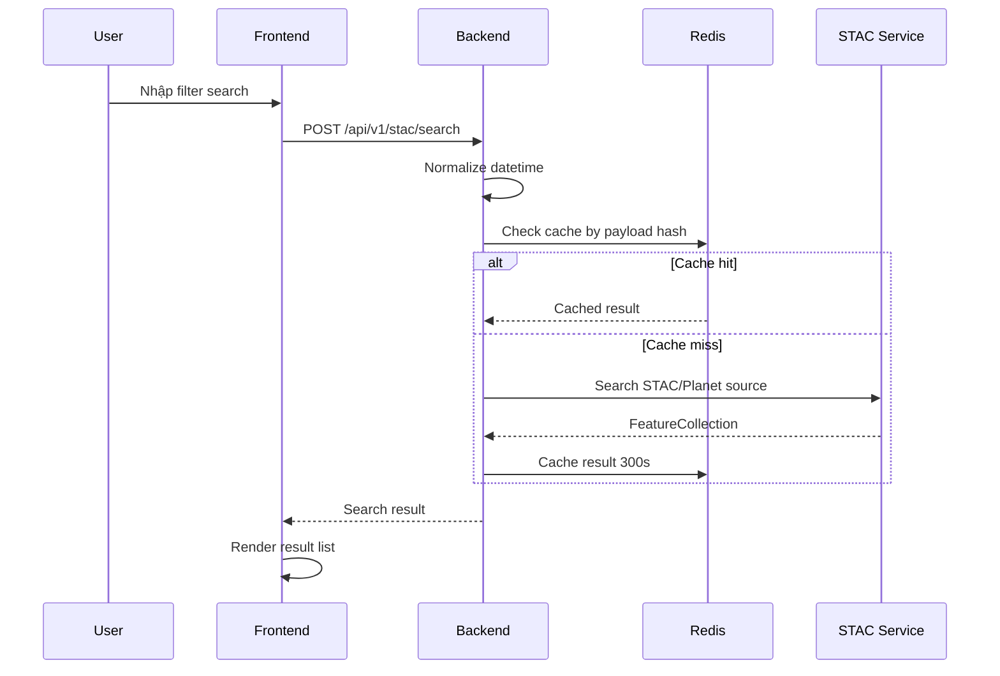

## 7. Luồng chọn STAC item

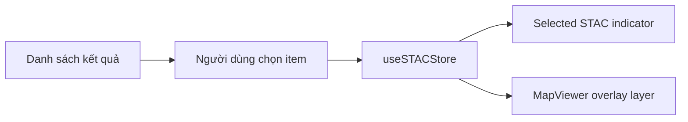

## 8. Luồng tạo AI detection job

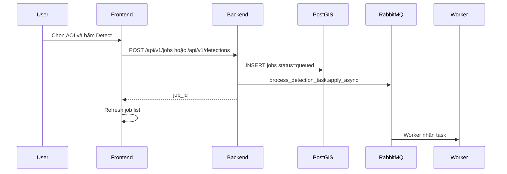

## 9. Luồng xử lý AI detection trong worker

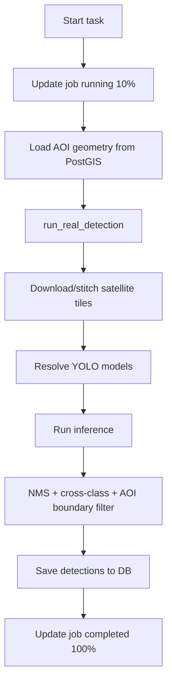

## 10. Luồng realtime progress

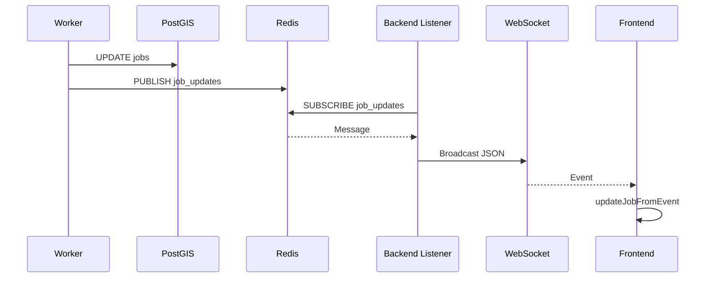

## 11. Luồng lấy kết quả detection

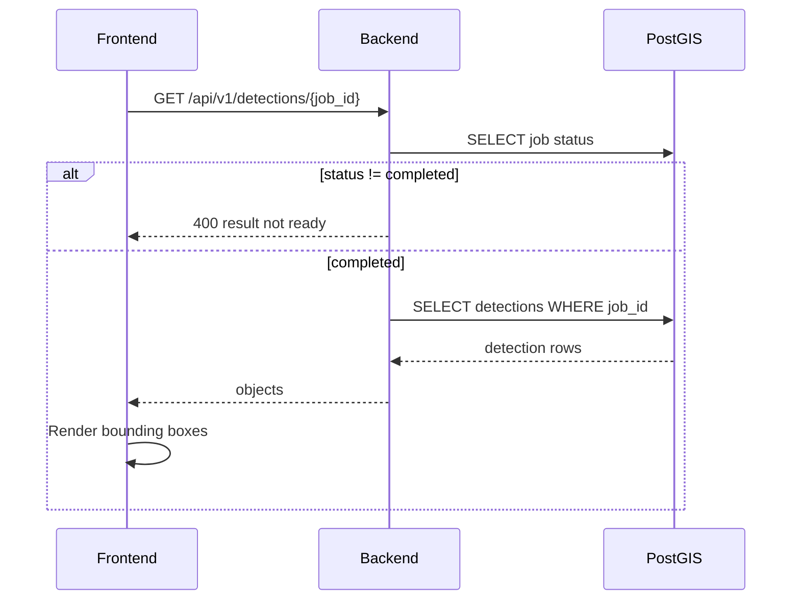

## 12. Luồng xóa AOI

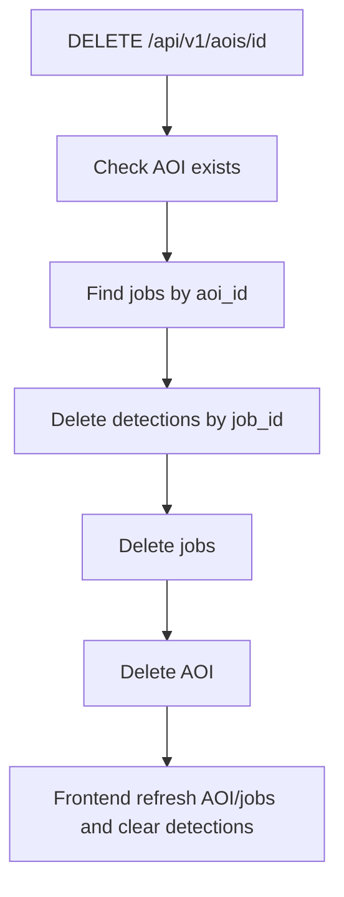

