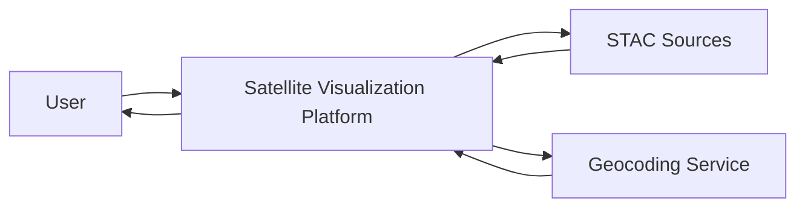
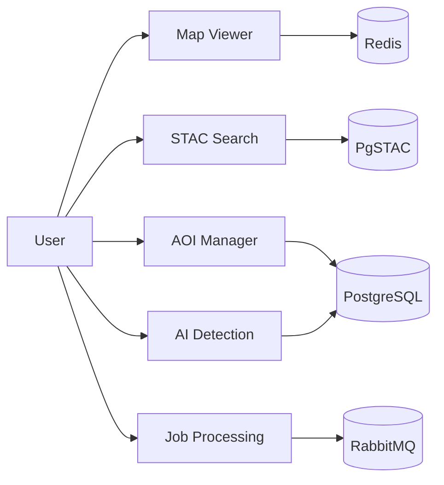
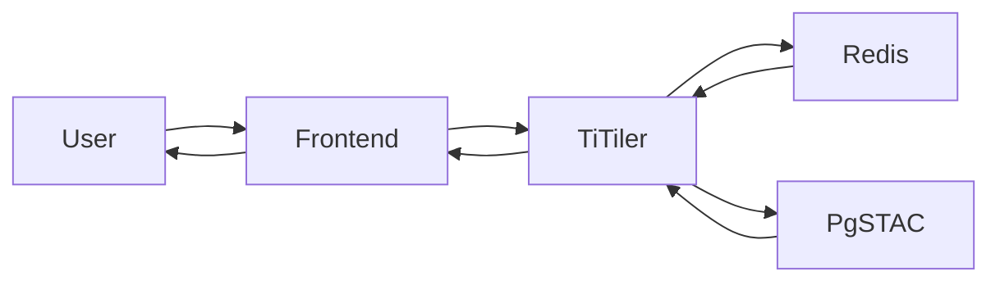
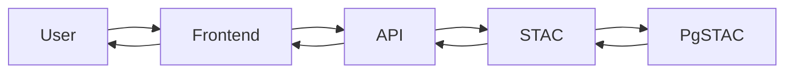
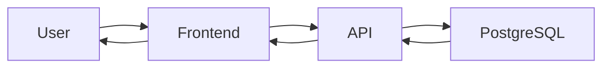
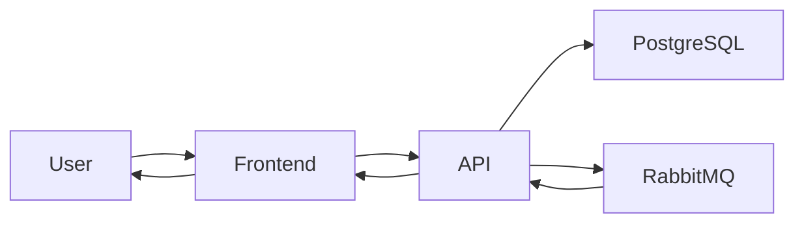
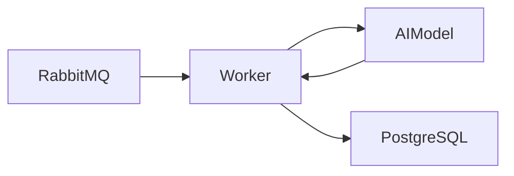
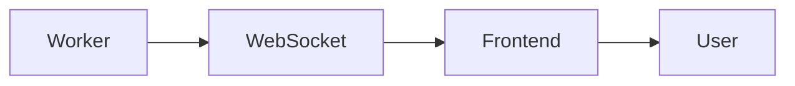
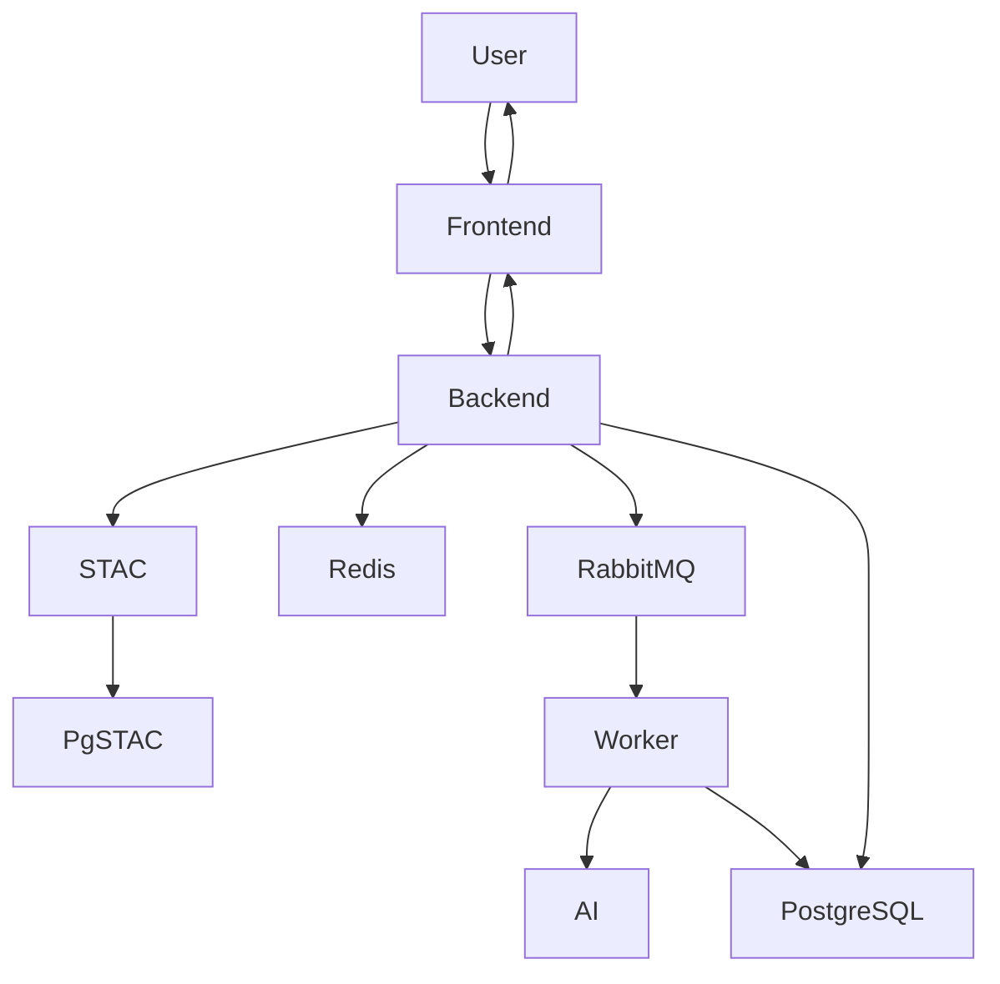

# data-flow-diagrams.md

# Data Flow Diagrams

## 1. Giới thiệu

Tài liệu mô tả luồng dữ liệu của hệ thống:

> Nền tảng xử lý và trực quan hóa ảnh vệ tinh hiệu năng cao dựa trên chuẩn STAC

Mục tiêu:

- Hiểu luồng dữ liệu tổng thể
- Xác định nguồn dữ liệu
- Xác định nơi lưu trữ dữ liệu
- Hỗ trợ thiết kế hệ thống

---

# 2. Thành phần dữ liệu chính

## External Entities

### User

Người sử dụng hệ thống.

### STAC Data Source

Nguồn dữ liệu STAC:

- Sentinel-2
- Landsat
- Open Data

### Geocoding Service

Dịch vụ tìm kiếm địa điểm.

Ví dụ:

- Nominatim
- OpenStreetMap Search

---

## Data Stores

### D1 - PostgreSQL

Lưu:

- Users
- AOIs
- Jobs
- Detection Results

---

### D2 - PgSTAC

Lưu:

- Collections
- Items
- Assets

---

### D3 - Redis

Lưu:

- Tile Cache
- Metadata Cache
- Session Cache

---

### D4 - RabbitMQ

Lưu hàng đợi xử lý nền.

---

# 3. DFD Level 0

## Context Diagram



---

# 4. DFD Level 1

## Toàn hệ thống



---

# 5. DFD - Map Rendering

## Mục tiêu

Hiển thị bản đồ.



---

## Dữ liệu trao đổi

### Request

```json
{
  "z": 12,
  "x": 3450,
  "y": 1650
}
```

### Response

```text
PNG Tile
```

---

# 6. DFD - STAC Search

## Mục tiêu

Tìm kiếm ảnh vệ tinh.



---

## Input

```json
{
  "collection": "sentinel-2",
  "datetime": "2025-01-01/2025-12-31",
  "bbox": []
}
```

---

## Output

```json
{
  "features": []
}
```

---

# 7. DFD - AOI Management

## Mục tiêu

Quản lý khu vực quan tâm.



---

## Input

```json
{
  "name": "Noi Bai",
  "geometry": {}
}
```

---

## Output

```json
{
  "id": "uuid"
}
```

---

# 8. DFD - Temporal Comparison

## Mục tiêu

So sánh ảnh theo thời gian.


---

## Input

```json
{
  "dateA": "2024-01-01",
  "dateB": "2025-01-01"
}
```

---

## Output

```json
{
  "imageA": "...",
  "imageB": "..."
}
```

---

# 9. DFD - Detection Job

## Mục tiêu

Tạo Job nhận dạng đối tượng.



---

## Input

```json
{
  "jobType": "vehicle_detection"
}
```

---

## Output

```json
{
  "jobId": "uuid"
}
```

---

# 10. DFD - AI Inference

## Mục tiêu

Xử lý Detection.



---

## Input

```json
{
  "image": "satellite-image"
}
```

---

## Output

```json
{
  "objects": []
}
```

---

# 11. DFD - Realtime Monitoring

## Mục tiêu

Theo dõi tiến trình Job.



---

## Dữ liệu

```json
{
  "jobId": "...",
  "progress": 75
}
```

---

# 12. Luồng dữ liệu tổng thể



---

# 13. Data Dictionary

## AOI

```json
{
  "id": "uuid",
  "name": "string",
  "geometry": "GeoJSON"
}
```

---

## Job

```json
{
  "id": "uuid",
  "status": "pending",
  "progress": 0
}
```

---

## Detection Result

```json
{
  "class": "vehicle",
  "confidence": 0.95,
  "bbox": []
}
```

---

## STAC Item

```json
{
  "id": "string",
  "datetime": "datetime",
  "assets": {}
}
```

---

# 14. Kết luận

Hệ thống được thiết kế với luồng dữ liệu phân tách rõ ràng:

- Metadata → PgSTAC
- Business Data → PostgreSQL
- Cache → Redis
- Async Jobs → RabbitMQ
- AI Results → PostgreSQL

Kiến trúc này giúp hệ thống dễ mở rộng, dễ tối ưu hiệu năng và phù hợp với các ứng dụng WebGIS xử lý dữ liệu vệ tinh quy mô lớn.