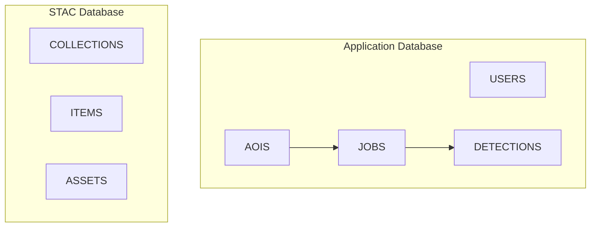
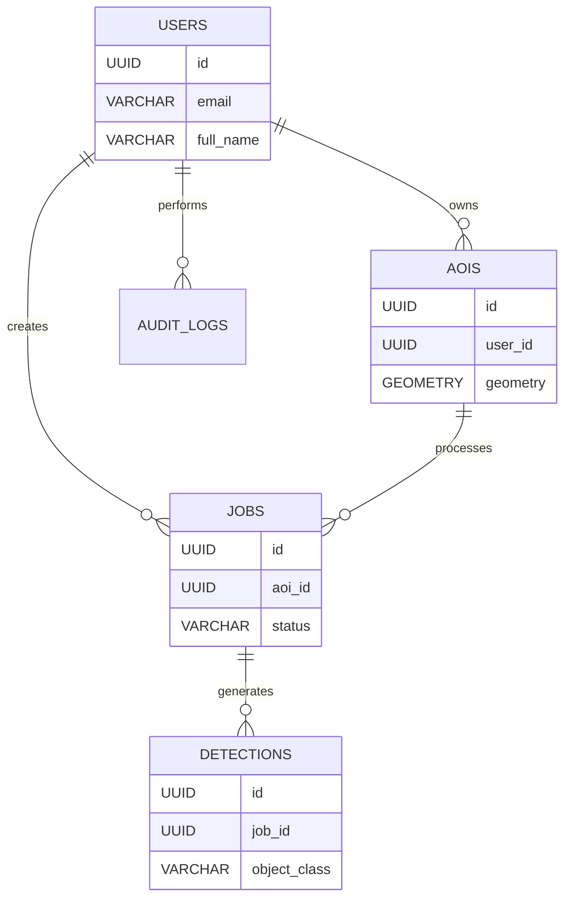

# database-design.md

# Thiết kế cơ sở dữ liệu

## 1. Mục tiêu thiết kế

Hệ thống sử dụng mô hình dữ liệu lai (Hybrid Data Architecture) bao gồm:

1. **Application Database**

   * Lưu trữ dữ liệu nghiệp vụ của hệ thống
   * Quản lý người dùng
   * Quản lý AOI
   * Quản lý Job
   * Quản lý kết quả AI Detection

2. **STAC Database**

   * Lưu trữ metadata ảnh vệ tinh
   * Tuân thủ chuẩn STAC
   * Được quản lý bởi PgSTAC

---

# 2. Kiến trúc dữ liệu



---

# 3. PostgreSQL Extensions

## PostGIS

Hệ thống sử dụng PostGIS để xử lý dữ liệu không gian.

### Các kiểu dữ liệu sử dụng

| Kiểu         | Mô tả          |
| ------------ | -------------- |
| POINT        | Tọa độ điểm    |
| POLYGON      | Vùng AOI       |
| MULTIPOLYGON | Nhiều vùng AOI |
| GEOGRAPHY    | Dữ liệu địa lý |

---

# 4. User Management

## Bảng users

Lưu thông tin người dùng.

### Schema

```sql
CREATE TABLE users (
    id UUID PRIMARY KEY,
    email VARCHAR(255) UNIQUE NOT NULL,
    full_name VARCHAR(255),
    password_hash TEXT NOT NULL,
    role VARCHAR(50) DEFAULT 'user',
    is_active BOOLEAN DEFAULT TRUE,
    created_at TIMESTAMP,
    updated_at TIMESTAMP
);
```

---

### Mô tả

| Cột           | Kiểu    | Mô tả                |
| ------------- | ------- | -------------------- |
| id            | UUID    | Khóa chính           |
| email         | VARCHAR | Email đăng nhập      |
| full_name     | VARCHAR | Họ tên               |
| password_hash | TEXT    | Mật khẩu mã hóa      |
| role          | VARCHAR | Quyền người dùng     |
| is_active     | BOOLEAN | Trạng thái tài khoản |

---

# 5. AOI Management

## Bảng aois

Lưu khu vực quan tâm.

### Schema

```sql
CREATE TABLE aois (
    id UUID PRIMARY KEY,
    user_id UUID REFERENCES users(id),
    name VARCHAR(255),
    description TEXT,
    geometry GEOMETRY(POLYGON,4326),
    area DOUBLE PRECISION,
    perimeter DOUBLE PRECISION,
    created_at TIMESTAMP,
    updated_at TIMESTAMP
);
```

---

### Mô tả

| Cột       | Kiểu        |
| --------- | ----------- |
| geometry  | Polygon AOI |
| area      | Diện tích   |
| perimeter | Chu vi      |

---

### Ví dụ

```json
{
  "type":"Polygon",
  "coordinates":[
    [
      [105.80,21.02],
      [105.81,21.02],
      [105.81,21.03],
      [105.80,21.03],
      [105.80,21.02]
    ]
  ]
}
```

---

# 6. Job Management

## Bảng jobs

Lưu trạng thái xử lý nền.

### Schema

```sql
CREATE TABLE jobs (
    id UUID PRIMARY KEY,
    user_id UUID REFERENCES users(id),
    aoi_id UUID REFERENCES aois(id),

    job_type VARCHAR(100),

    status VARCHAR(50),

    progress INTEGER DEFAULT 0,

    result_url TEXT,

    error_message TEXT,

    started_at TIMESTAMP,

    completed_at TIMESTAMP,

    created_at TIMESTAMP
);
```

---

### Các loại Job

| Job Type          |
| ----------------- |
| aoi_extraction    |
| image_download    |
| ndvi_calculation  |
| object_detection  |
| report_generation |

---

### Trạng thái

| Status    |
| --------- |
| pending   |
| running   |
| completed |
| failed    |
| cancelled |

---

# 7. Detection Results

## Bảng detections

Lưu kết quả AI Detection.

### Schema

```sql
CREATE TABLE detections (
    id UUID PRIMARY KEY,

    job_id UUID REFERENCES jobs(id),

    object_class VARCHAR(100),

    confidence DOUBLE PRECISION,

    bbox JSONB,

    created_at TIMESTAMP
);
```

---

### Ví dụ dữ liệu

```json
{
  "object_class":"vehicle",
  "confidence":0.94,
  "bbox":[
    100,
    120,
    140,
    160
  ]
}
```

---

# 8. Audit Log

## Bảng audit_logs

Theo dõi lịch sử hoạt động.

### Schema

```sql
CREATE TABLE audit_logs (
    id UUID PRIMARY KEY,

    user_id UUID REFERENCES users(id),

    action VARCHAR(255),

    entity_type VARCHAR(255),

    entity_id UUID,

    created_at TIMESTAMP
);
```

---

### Ví dụ

```text
CREATE_AOI

DELETE_AOI

START_DETECTION

DOWNLOAD_IMAGE
```

---

# 9. STAC Data Model

PgSTAC sẽ quản lý các bảng STAC riêng.

---

## Collections

Đại diện cho tập dữ liệu.

Ví dụ:

```text
Sentinel-2

Landsat-8

PlanetScope
```

---

## Items

Đại diện cho từng ảnh vệ tinh.

Ví dụ:

```text
Sentinel-2
│
├── Image 01/01/2026
├── Image 05/01/2026
└── Image 10/01/2026
```

---

## Assets

Đại diện cho dữ liệu thực tế.

Ví dụ:

```text
image.tif

thumbnail.jpg

metadata.json
```

---

# 10. Quan hệ dữ liệu

## ERD Logic



---

# 11. Chỉ mục (Indexes)

## AOI Spatial Index

```sql
CREATE INDEX idx_aois_geometry
ON aois
USING GIST(geometry);
```

---

## Jobs Status Index

```sql
CREATE INDEX idx_jobs_status
ON jobs(status);
```

---

## User Email Index

```sql
CREATE UNIQUE INDEX idx_users_email
ON users(email);
```

---

# 12. Chiến lược phân vùng dữ liệu

Đối với dữ liệu lớn:

### Partition theo thời gian

```text
jobs_2026_01

jobs_2026_02

jobs_2026_03
```

---

### Partition theo Collection

```text
sentinel_collection

landsat_collection
```

---

# 13. Chính sách lưu trữ

## Metadata

Lưu trong PostgreSQL.

---

## GeoTIFF

Không lưu trực tiếp trong database.

Lưu tại:

```text
Object Storage

S3

MinIO
```

Database chỉ lưu:

```text
URL

Path

Metadata
```

---

# 14. Backup Strategy

### Daily Backup

* PostgreSQL Dump

### Weekly Backup

* Full Snapshot

### Monthly Backup

* Archive Backup

---

# 15. Kết luận

Thiết kế cơ sở dữ liệu được xây dựng theo hướng:

* Chuẩn hóa dữ liệu
* Tối ưu truy vấn không gian
* Dễ mở rộng
* Hỗ trợ dữ liệu GIS
* Tương thích với STAC

Kiến trúc này đáp ứng tốt các yêu cầu về:

* Quản lý AOI
* Quản lý Job
* AI Detection
* Metadata ảnh vệ tinh
* Spatial Query
* Temporal Query
