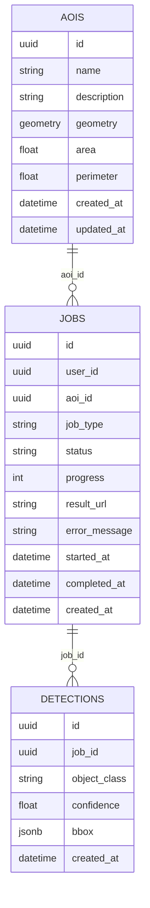

# Thiết kế cơ sở dữ liệu

## 1. Tổng quan

Hệ thống sử dụng PostgreSQL tích hợp PostGIS và PgSTAC. Cùng một database phục
vụ hai nhóm dữ liệu:

1. Dữ liệu nghiệp vụ của ứng dụng: AOI, jobs, detections.
2. Metadata STAC do PgSTAC quản lý.

Image Docker đang dùng:

```text
ghcr.io/stac-utils/pgstac:latest
```

Backend kết nối qua SQLAlchemy với `DATABASE_URL`.

## 2. Search path

Trong `backend/db/database.py`, engine được cấu hình:

```python
connect_args={"options": "-csearch_path=pgstac,public"}
```

Điều này cho phép backend nhìn thấy schema PgSTAC và public. Khi viết migration
hoặc truy vấn mới, cần cẩn thận tên bảng để tránh trùng với object PgSTAC.

## 3. Bảng `aois`

Mục đích: lưu vùng quan tâm do người dùng tạo.

| Cột | Kiểu | Ý nghĩa |
| --- | --- | --- |
| `id` | UUID | Khóa chính |
| `name` | String(255) | Tên AOI |
| `description` | String | Mô tả |
| `geometry` | GEOMETRY(POLYGON, 4326) | Hình học AOI |
| `area` | Float | Diện tích theo mét vuông |
| `perimeter` | Float | Chu vi theo mét |
| `created_at` | DateTime | Thời gian tạo |
| `updated_at` | DateTime | Thời gian cập nhật |

Index:

```sql
CREATE INDEX idx_aois_geometry ON aois USING gist (geometry);
```

Backend không lưu geometry dưới dạng JSON text. Geometry được convert từ
GeoJSON bằng PostGIS:

```sql
ST_SetSRID(ST_GeomFromGeoJSON(:geom), 4326)
```

Khi trả về frontend, geometry được convert ngược:

```sql
ST_AsGeoJSON(geometry)
```

## 4. Bảng `jobs`

Mục đích: theo dõi tác vụ nền.

| Cột | Kiểu | Ý nghĩa |
| --- | --- | --- |
| `id` | UUID | Khóa chính, đồng thời dùng làm Celery task id |
| `user_id` | UUID nullable | Dự phòng cho authentication tương lai |
| `aoi_id` | UUID nullable | AOI liên quan |
| `job_type` | String(100) | Loại job |
| `status` | String(50) | Trạng thái job |
| `progress` | Integer | Tiến trình 0-100 |
| `result_url` | String nullable | URL lấy kết quả |
| `error_message` | String nullable | Lỗi nếu có |
| `started_at` | DateTime nullable | Thời điểm bắt đầu |
| `completed_at` | DateTime nullable | Thời điểm kết thúc |
| `created_at` | DateTime | Thời điểm tạo |

Status hiện dùng:

- `pending`
- `queued`
- `running`
- `completed`
- `failed`
- `cancelled`

Job type hiện có trong schema:

- `object_detection`
- `aoi_extraction`
- `comparison`

Worker hiện xử lý thực tế `object_detection`.

## 5. Bảng `detections`

Mục đích: lưu kết quả AI detection.

| Cột | Kiểu | Ý nghĩa |
| --- | --- | --- |
| `id` | UUID | Khóa chính |
| `job_id` | UUID | Job sinh ra detection |
| `object_class` | String(100) | Lớp đối tượng |
| `confidence` | Float | Độ tin cậy |
| `bbox` | JSONB | Bounding box địa lý |
| `created_at` | DateTime | Thời điểm tạo |

`bbox` có định dạng:

```json
[min_lng, min_lat, max_lng, max_lat]
```

Các lớp đối tượng:

- `aircraft`
- `ship`
- `vehicle`

## 6. Quan hệ dữ liệu



Hiện tại model không khai báo foreign key cứng trong SQLAlchemy, nhưng logic
ứng dụng xử lý quan hệ:

- Xóa AOI sẽ xóa jobs liên quan.
- Xóa jobs liên quan sẽ xóa detections liên quan.

Production nên bổ sung foreign key và cascade nếu muốn đảm bảo toàn vẹn dữ liệu
ở mức database.

## 7. PgSTAC schema

PgSTAC lưu metadata STAC, bao gồm:

- Collections.
- Items.
- Assets.
- Geometry và temporal metadata.

Ứng dụng không tự định nghĩa các bảng PgSTAC bằng Alembic. STAC FastAPI và
PgSTAC quản lý phần này.

## 8. Migration

Các migration hiện có:

- Tạo bảng `aois`.
- Tạo bảng `jobs` và `detections`.
- Thêm index.

Chạy migration:

```bash
cd backend
alembic upgrade head
```

Trong Docker:

```bash
docker compose exec backend alembic upgrade head
```

## 9. Khuyến nghị cải thiện

- Thêm foreign key giữa `jobs.aoi_id` và `aois.id`.
- Thêm foreign key giữa `detections.job_id` và `jobs.id`.
- Thêm index cho `jobs.status`, `jobs.job_type`, `jobs.created_at`.
- Thêm index cho `detections.job_id`.
- Thêm audit fields nếu có authentication.
- Tách schema ứng dụng khỏi schema PgSTAC rõ ràng hơn khi production.

