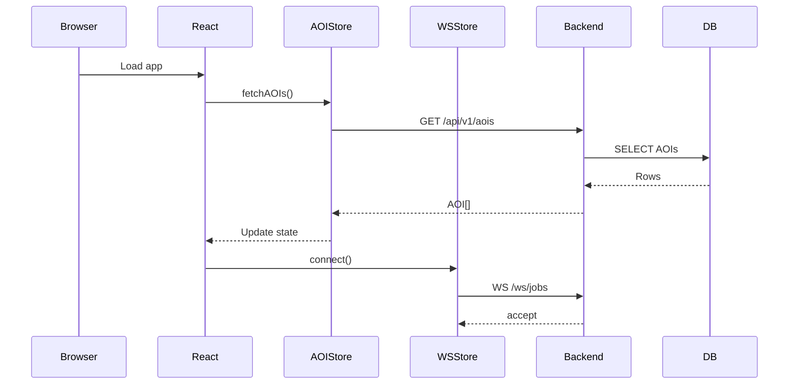
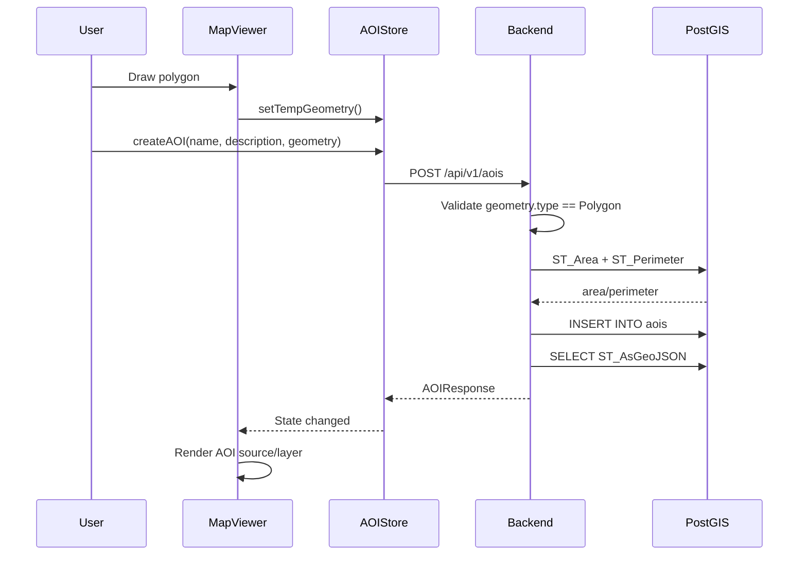
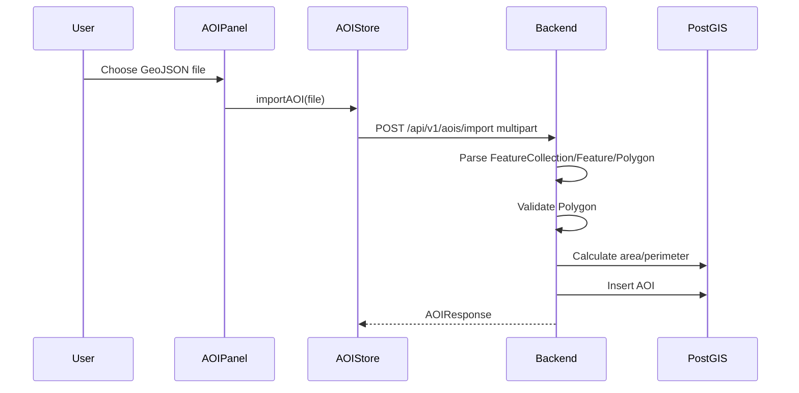
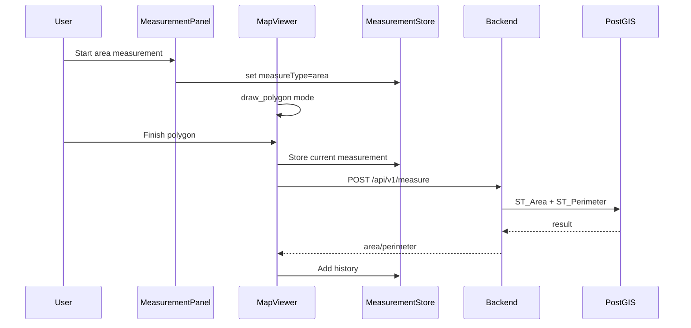
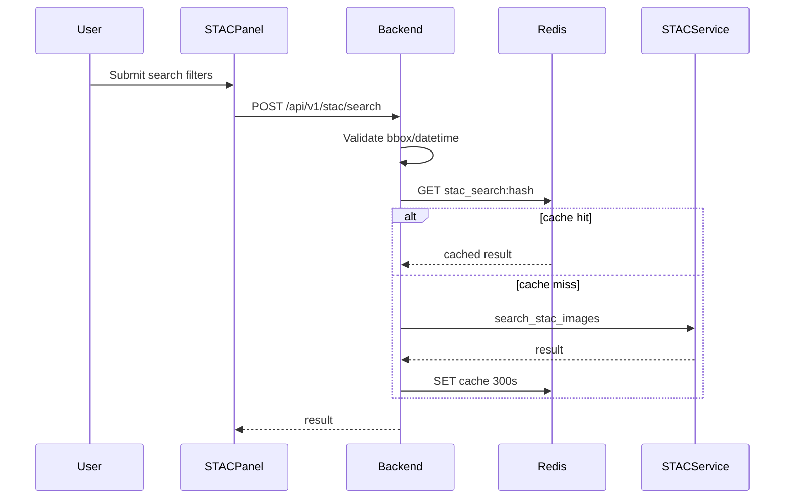
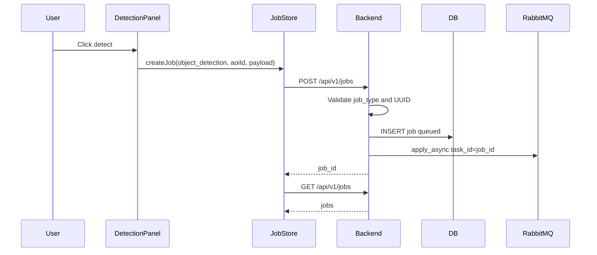
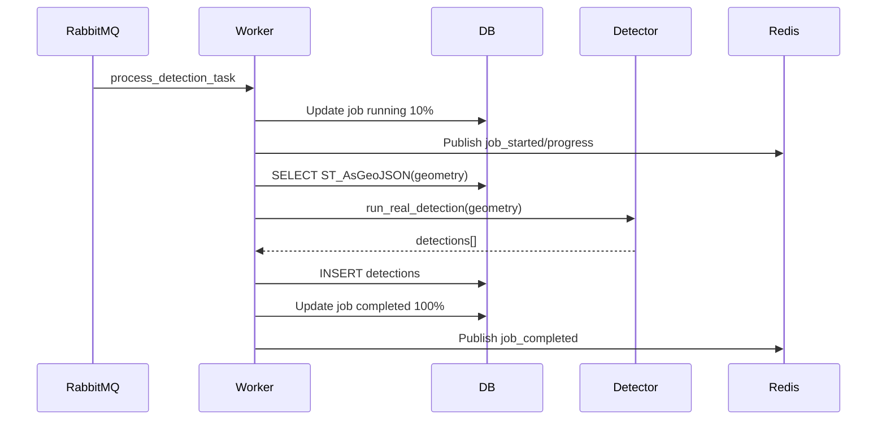
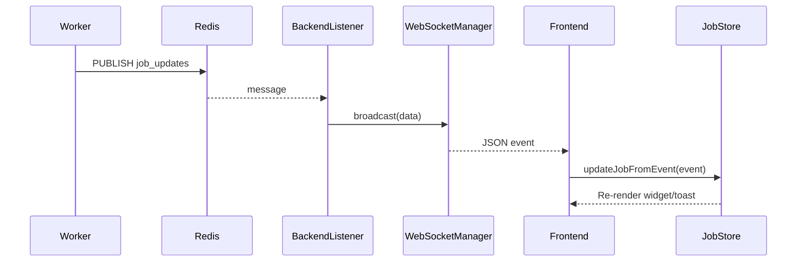
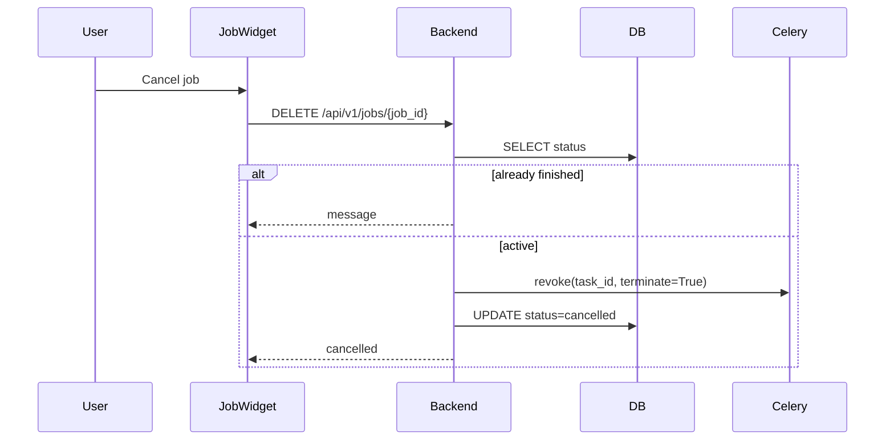

# Sequence Diagrams

## 1. Mục tiêu

Tài liệu này tập trung vào các sequence diagram chi tiết cho những use case
quan trọng nhất của hệ thống.

## 2. Khởi động frontend và kết nối realtime

## 3. Tạo AOI

## 4. Import AOI

## 5. Đo diện tích

## 6. STAC search theo bbox

## 7. Tạo job detection

## 8. Worker xử lý detection

## 9. WebSocket cập nhật frontend

## 10. Hủy job

