# sequence-diagrams.md

# Sequence Diagrams

## 1. Giới thiệu

Tài liệu này mô tả luồng tương tác giữa các thành phần trong hệ thống:

- Frontend (React)
- Backend (FastAPI)
- STAC FastAPI
- PgSTAC
- TiTiler
- Redis
- RabbitMQ
- Celery Worker
- AI Service

Các sơ đồ được sử dụng để:

- Hiểu luồng xử lý
- Thiết kế API
- Thiết kế Service
- Hỗ trợ triển khai

---

# SD01 - Hiển thị bản đồ

## Mục tiêu

Hiển thị bản đồ nền và ảnh vệ tinh.

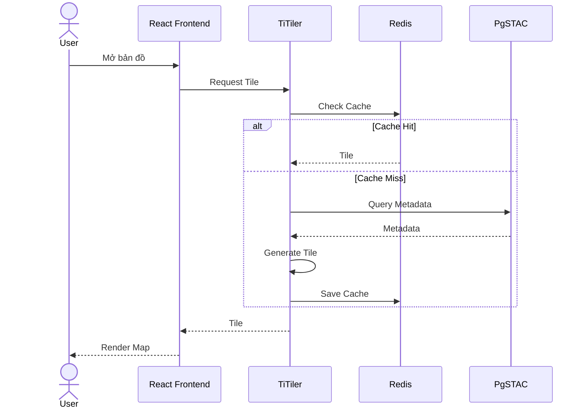

---

# SD02 - Tìm kiếm vị trí

## Mục tiêu

Tìm kiếm theo tên địa danh.

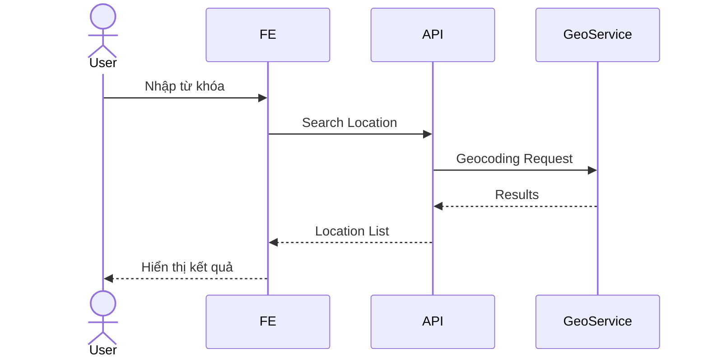

---

# SD03 - Truy vấn dữ liệu STAC

## Mục tiêu

Tìm kiếm ảnh vệ tinh.

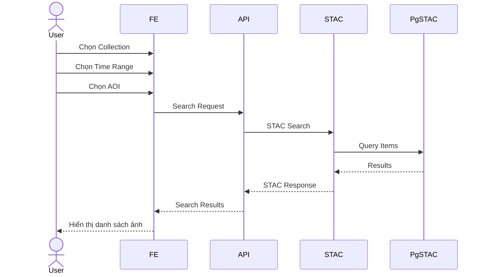

---

# SD04 - Tạo AOI

## Mục tiêu

Lưu vùng quan tâm.

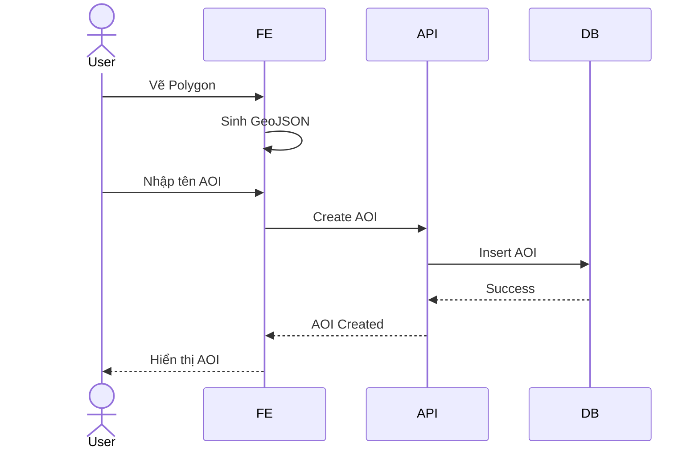

---

# SD05 - Chỉnh sửa AOI

## Mục tiêu

Cập nhật AOI.

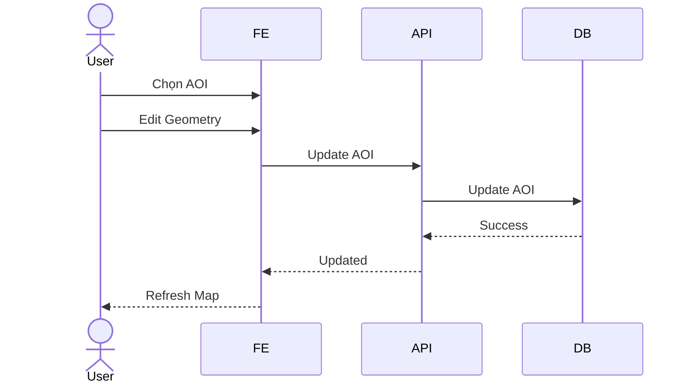

---

# SD06 - Xóa AOI

## Mục tiêu

Xóa AOI.

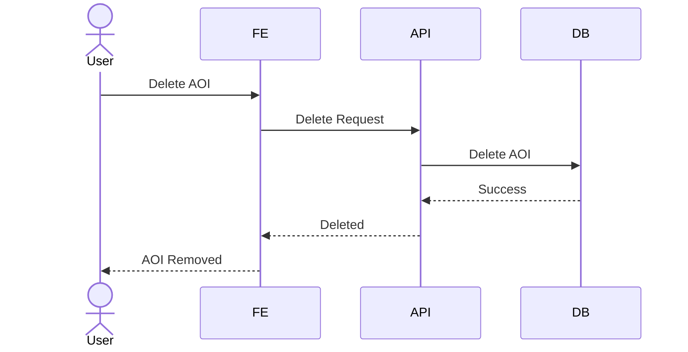

---

# SD07 - Đo diện tích

## Mục tiêu

Tính diện tích AOI.

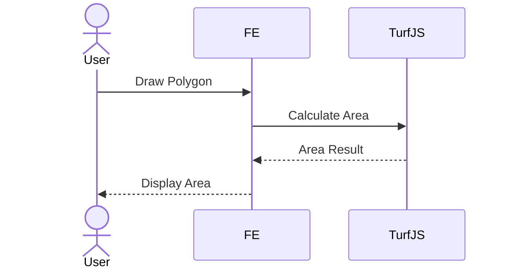

---

# SD08 - Đo khoảng cách

## Mục tiêu

Tính khoảng cách.

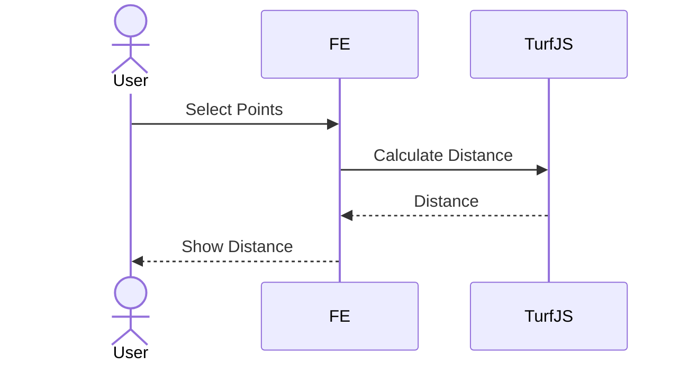

---

# SD09 - So sánh ảnh theo thời gian

## Mục tiêu

Hiển thị Before/After.

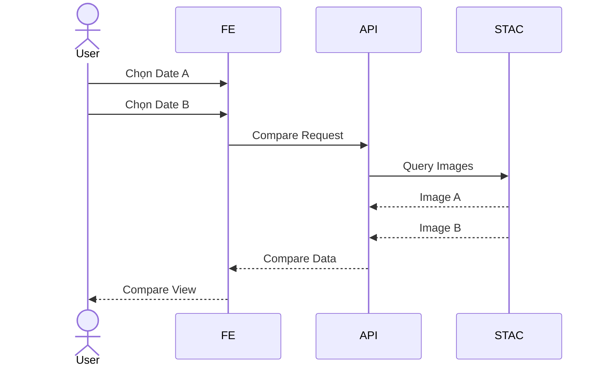

---

# SD10 - Tạo Job Detection

## Mục tiêu

Khởi tạo Detection Job.

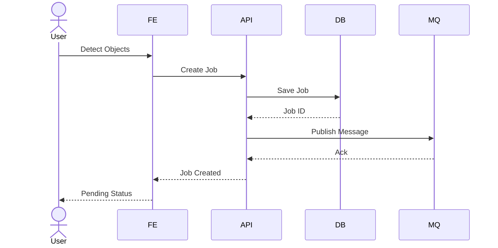

---

# SD11 - Worker xử lý Detection

## Mục tiêu

Thực hiện AI Inference.

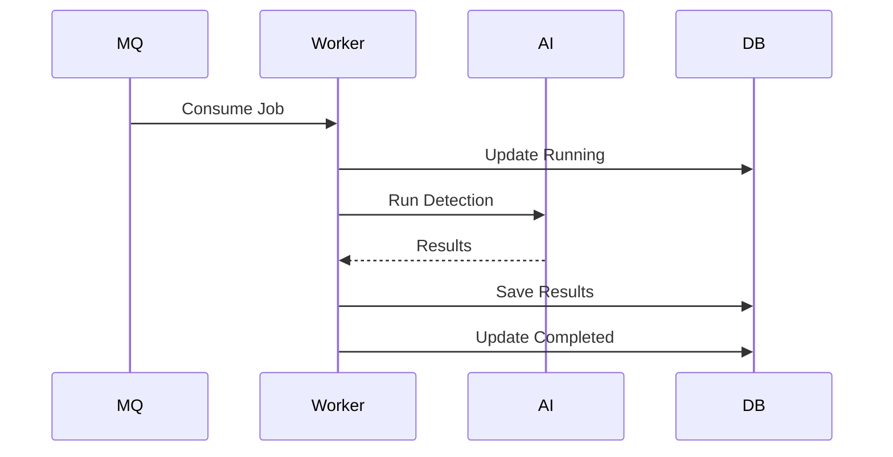

---

# SD12 - Theo dõi tiến trình Job

## Mục tiêu

Realtime Progress.

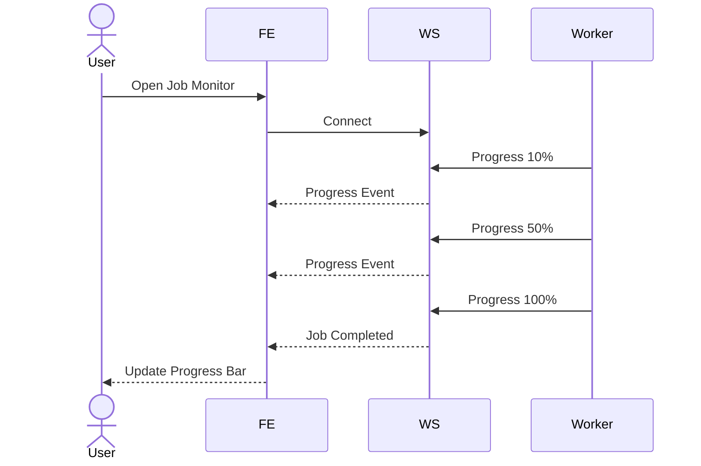

---

# SD13 - Xem kết quả Detection

## Mục tiêu

Hiển thị kết quả nhận dạng.

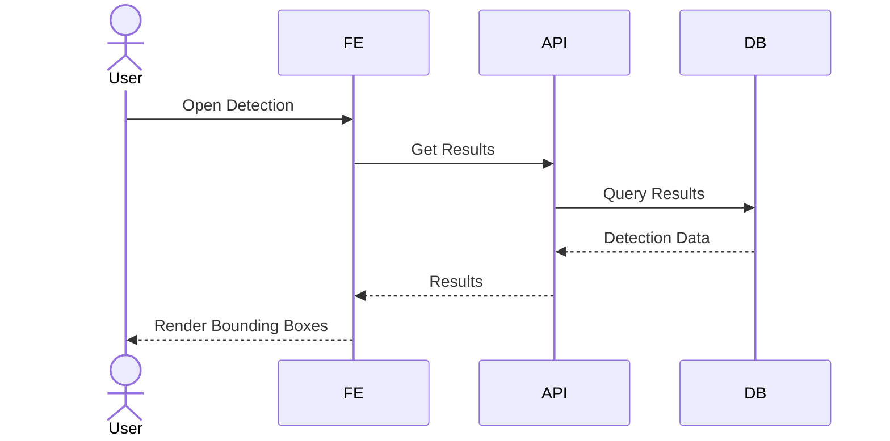

---

# SD14 - Luồng Cache Tile

## Mục tiêu

Tối ưu truy vấn Tile.

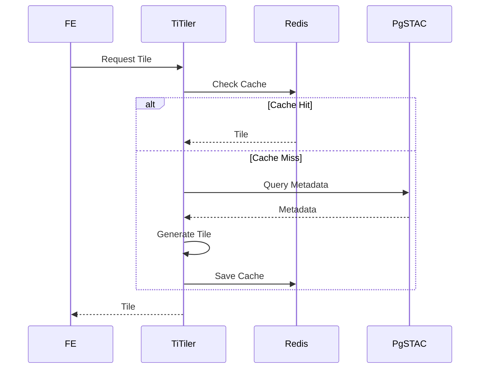

---

# SD15 - Luồng toàn hệ thống

## End-to-End Flow

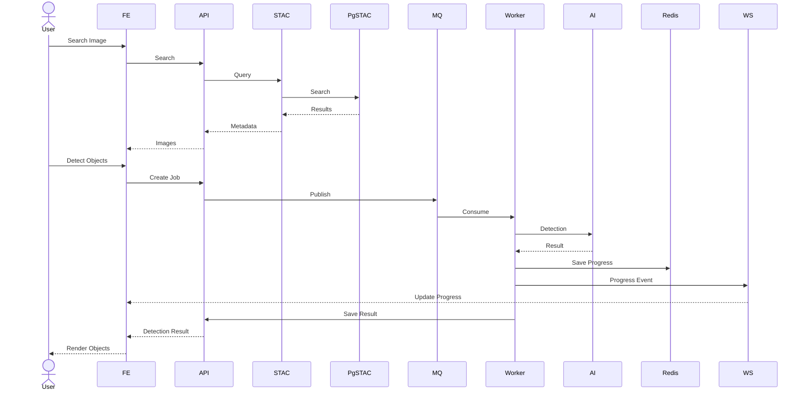

---

# Tổng kết

Tài liệu hiện bao gồm 15 Sequence Diagram:

| ID | Sequence Diagram |
|------|-------------------|
| SD01 | Hiển thị bản đồ |
| SD02 | Tìm kiếm vị trí |
| SD03 | STAC Search |
| SD04 | Tạo AOI |
| SD05 | Chỉnh sửa AOI |
| SD06 | Xóa AOI |
| SD07 | Đo diện tích |
| SD08 | Đo khoảng cách |
| SD09 | So sánh ảnh |
| SD10 | Tạo Detection Job |
| SD11 | Worker Detection |
| SD12 | Theo dõi Job |
| SD13 | Xem Detection |
| SD14 | Tile Cache |
| SD15 | End-to-End Flow |

Các sơ đồ này phản ánh đầy đủ luồng hoạt động của hệ thống từ frontend tới backend, STAC services, queue processing và AI inference.